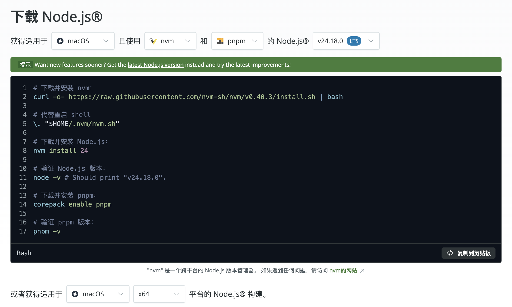

## 1、Node.js

+ 1、Node.js 是一个让 JavaScript 能在服务器端运行的环境‌，它让前端开发者也能用熟悉的语言写后端程序。‌‌‌

+ 2、Node.js 不是编程语言本身，而是‌JavaScript 的运行时环境‌，就像浏览器能运行JavaScript一样，它让JavaScript也能在服务器、命令行等地方跑起来。它基于Chrome的V8引擎开发，是开源跨平台的工具。‌‌‌

## 2、Node.js 下载安装



## 3、使用nvm控制node版本

+ 1、当前使用的node版本

```bash
nvm ls
```

+ 2、切换任意的node版本

```bash
nvm use 版本号
```

+ 3、配置文件恢复node版本

```bash
在当前搭建工程根目录下加一个 .nvmrc 配置文件 写上当前搭建工程的node版本
```

## 4、使用nrm切换镜像源

+ 1、安装

```bash
npm install -g nrm
```

+ 2、查看所有可用的镜像源

```bash
nrm ls
```

+ 3、切换镜像源为 taobao 镜像

```bash
nrm use taobao
```

## 5、pnpm

**pnpm包管理工具**

+ 1、特点：速度快、节约磁盘空间、支持 monorepo、安全性高。

+ 2、pnpm对比npm/yarn的优点：更快速的依赖下载、更高效的利用磁盘空间、更优秀的依赖管理。

**pnpm的安装和使用**

+ 1、准备

> Node环境(✔️) && npm环境（✔️）

+ 2、安装

```shell
npm install -g pnpm
```

> 查看版本信息

```shell
pnpm -v
```

+ 3、设置镜像源

> 查看当前配置的镜像源

```shell
npm config get registry
```

> 设置新的镜像源

```shell
npm config set registry https://registry.npmmirror.com/
```

> 检查新的镜像源是否设置成功

```shell
npm config get registry
```

+ 4、常用命令对比

> 1、npm 命令

```shell
npm install 安装全部依赖

npm install (包名) 安装指定包

npm uninstall (包名) 移除指定包

npm run 脚本 运行脚本
```

> 2、yarn 命令

```shell
yarn install 安装全部依赖

pnpm add (包名) 安装指定包

yarn remove (包名) 移除指定包

yarn run 脚本 运行脚本
```

> 3、pnpm 命令

```shell
pnpm install 安装全部依赖

pnpm add (包名) 安装指定包

pnpm remove (包名) 移除指定包

pnpm run 脚本 运行脚本
```

## 6、依赖检查工具 - depcheck

+ 1、安装

```shell
npm install -g depcheck
```

+ 2、在项目中使用 Depcheck 检查依赖

```shell
depcheck
```

+ 3、安装缺失依赖

```shell
npm install [缺失的依赖]
```

## 7、md文档转换为html页面工具 - i5ting_toc

+ 1、安装

```shell
npm install -g i5ting_toc
```

+ 2、实现 md 转 html

```shell
i5ting_toc -f README.md -o
```
